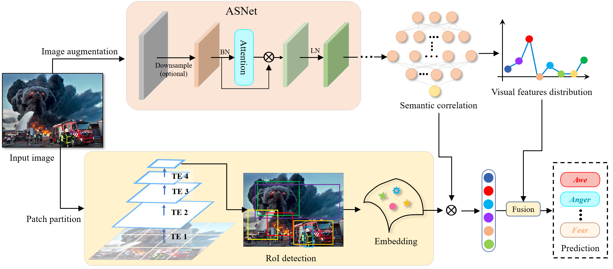
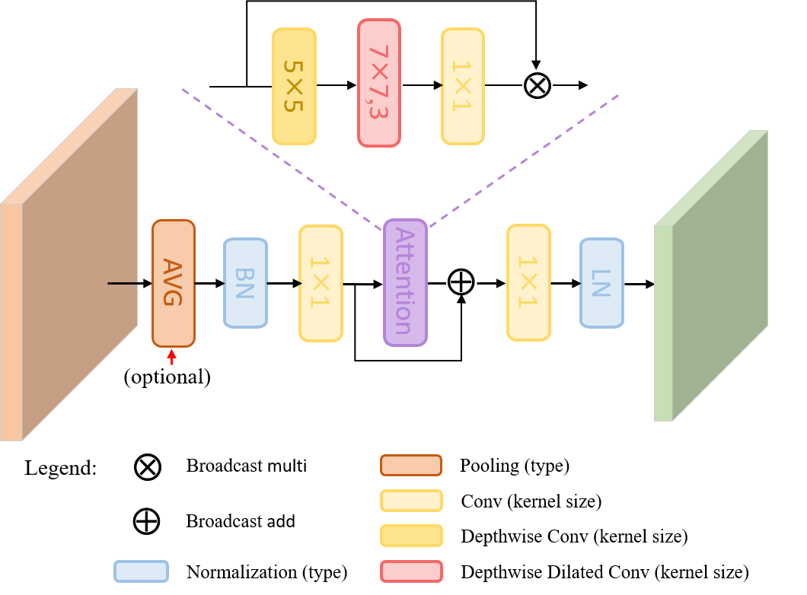
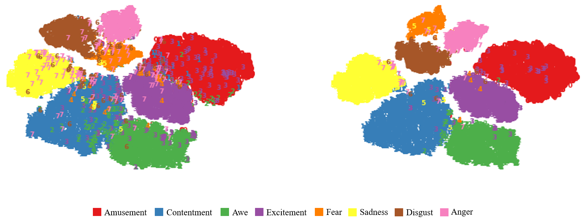

# Attention-Aware Visual Sentiment Analysis with Objective Correlative

The Pytorch implementation of "Attention-Aware Visual Sentiment Analysis with Objective Correlative"

## Structure

The overall framework of AOCNet. ASNet was developed to capture long-range dependency of semantic correlation in visual features, while swin transformer is adopt for local latent affective activation regions and convert them to semantic embeddings. Our model considers both visual information and semantics through fusion layers and outputs the final emotion distribution.

## Attention

The structure of non-local attention with enhanced small kernel. For easy viewing, the legend is shown below the figure.

## Requirements

You may need to install the package via pip:

* **CUDA = 10.2**
* **Python3**
* **Pyrotch >= 1.10**
* **d2lzh**

## Results

Classification performance achieved on **FI dataset**.

| Model         |    FI     |
| ------------- | :-------: |
| PAEF          |   46.13   |
| MKN           |   63.92   |
| WSCNet        |   70.07   |
| SOLVER        |   72.33   |
| Stimuli-Aware |   72.42   |
| MSRCA         |   72.60   |
| Our AOCNet    | **74.04** |

## Visualization

Visualization of affective feature embeddings. Each point represents an image in FI datasets. Different emotion labels are distinguished by different colors. The left and right plots show the feature space of the FI training set and the entire dataset, respectively. It is observed that our framework can separate the images from different emotion categories more effectively.

## Citation

Hao Zhang, Gaifang Luo, Zhaoyu Xiong, Xuejie Zhang, Dan Xu. Attention-Aware Visual Sentiment Analysis with Objective Correlative[J]. This is a preprint version, 2023.